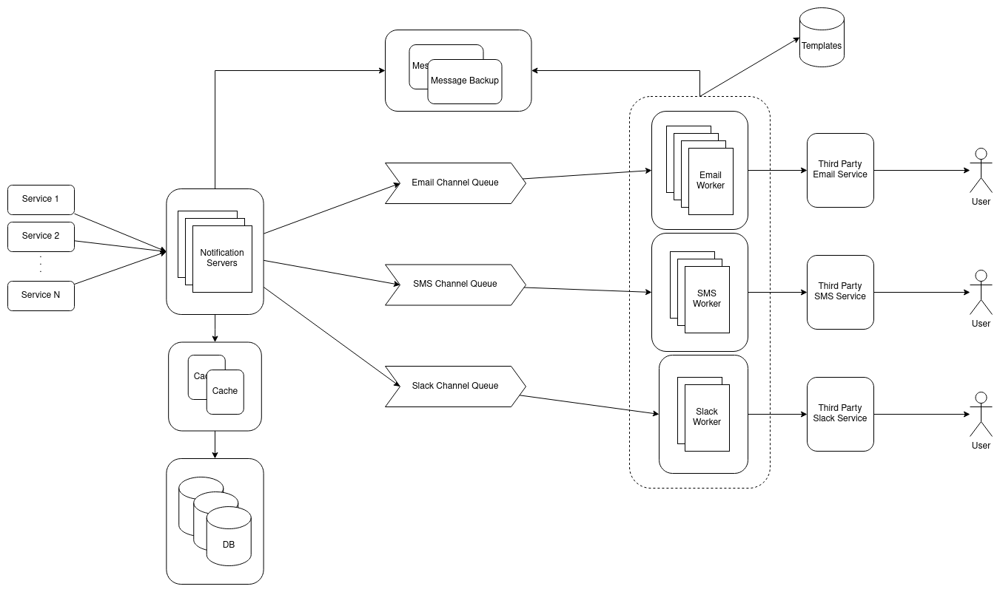

# Notification Service

### High level overview

1. Services 1...N
These are the services that can use our notificaiton API. The services will be able to post a notification message in a channel and be guaranteed that the message will be given to the subscribed users. This means we should expect them to act in a fire-and-forget behaviour.

2. Notification Servers
The notification servers are covered in our implementation. They should be able to receive a message through an internal API, query who the message should be send to and send the message to that user, user-by-user. There should be a query in front of the database. The servers should validate the emails and render the message before sending it. The servers should also know how many notifications the queried user has received in a period of time and apply a rate limit to make sure the user does not get overwhelmed. After the users are selected and filtered on the servers, they will save the message in the database, ensuring that a message has been sent. The table should include a state, which we will discuss later. After the message is persisted, it is first send to backup message database database or queue for a retry mechanism, after which it is send to the corresponding channel queue for processing. This API should only be accessible from our services.

In addition, the notification servers offer an external API, where users will be able to subscribe and unsubscribe to topics and channels.

The notification servers will also handle a retry mechanism using a control loop, where if a message is found in the backup queue/database, then it will resend the message to the corresponding message queue. If all user messages are removed from the backup queue/database, the state should be changed.

3. Notification Workers
The notification workers are covered in our implementation. The notificaiton workers poll from their corresponding queue. They have access to a template database, where if they receive an html template, they will render it into the message. To get the template, a template id can be added to the message and the workers will query the template database to get it. There should be a cache in front of the database. After the message is finally prepared, it is send to a third party service that will forward the message to the user. After the message is send successfully, the worker will remove the message from backup queue/database.

#### States

The states that a message can be in are:
* **pending**, when the message is queued for processing.
* **active**, when the message is beign processed.
* **sent**, when all message have been sent successfully. End state.
* **failed**, when not all messages have been sent. 
* **stale**, when a message is lost and have to be resend.
* **deleted**, when the message should not be send. End state.

#### APIs

All apis can be found in our [open api spec](../openapi/swagger.yaml).